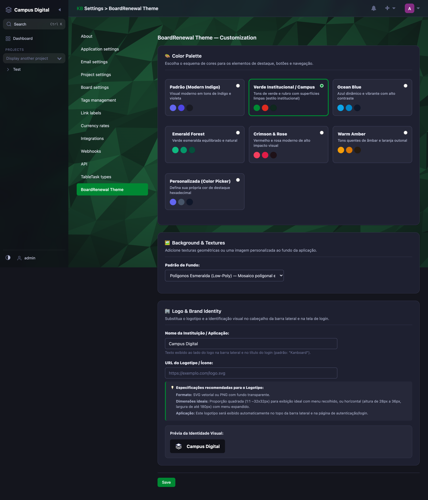
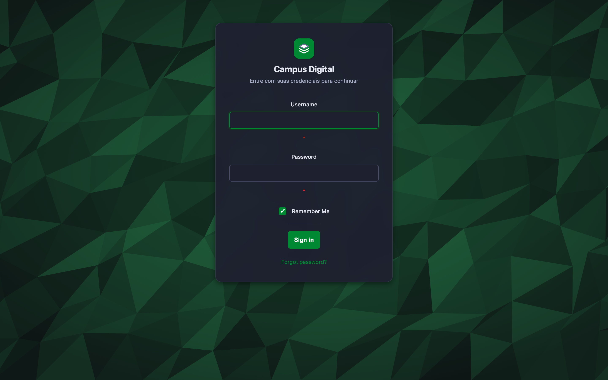
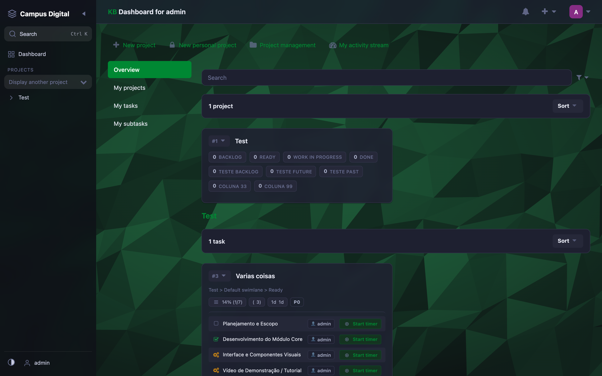
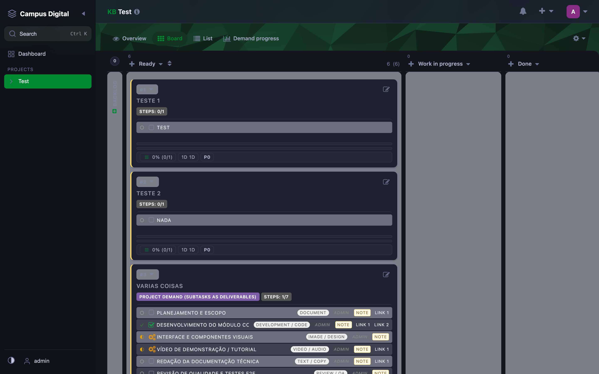

# BoardRenewal

A modern, responsive theme for [Kanboard](https://kanboard.org/) with customizable color palettes, background textures, custom branding/logo, dark mode, and slim rail board interactions.


## What's New in v0.2.0 ✨

- 🎛️ **In-App Theme Customizer**: New settings page at *Settings > Theme Appearance* (`Settings > Aparência do Tema`) with live preview!
- 🎨 **Palettes & Color Schemes**: Choose between *Padrão (Indigo Modern)*, *Verde Institucional (Emerald & Crimson Accent)*, and more.
- 📐 **Background Textures**: Built-in SVG patterns including *Polygon Emerald* (geometric faceted gradient).
- 🏷️ **Custom Brand Name & Logo**: Set your custom organization brand name and logo image URL (displayed across sidebar, topbar, and login screen).
- 📌 **Slim Vertical Rail Columns**: Collapsed board columns contract to a 36px vertical rail with rotated typography and one-click expand.
- 🦓 **Striped Subtasks Table**: Subtasks in board and dashboard cards rendered as a clean zebra-striped table without rigid borders.

---

## Features

### 🎨 Visual Design & Customization
- **Modern UI**: Clean, minimal design inspired by Linear, Vikunja, and modern design systems
- **Customization Settings**: Change colors, textures, and logos directly from the Kanboard admin interface
- **Responsive**: Works seamlessly on desktop, tablet, and mobile
- **Glassmorphism & Depth**: Subtle transparency effects on sidebar, topbar, cards, and modals
- **Custom Icons**: Modern rounded SVG icons throughout the interface

### 🌓 Theme Modes
- **Light Mode**: Clean, bright interface for daytime use
- **Dark Mode**: High contrast, easy on the eyes for night work
- **Auto Mode**: Automatically follows your system preference
- **High Contrast**: Enhanced visibility for accessibility

### 🎯 Key Improvements
- **Slim Rail Collapsed Columns**: Collapsing a board column shrinks it to a compact 36px rail with vertical orientation (`writing-mode: vertical-rl`) and task counter badge.
- **Zebra Subtasks**: Subtask lists feature alternating rows (`:nth-child`) and precise multi-column alignment (status, title, badges, assignee, timer).
- **Color-coded Cards**: Task cards show category color as an accent border without muddying card readability.
- **Custom Login Screen**: Modern centered card layout featuring the custom brand name and logo.

---

## Installation

### Method 1: Direct Download
1. Download the latest release archive from [GitHub Releases](https://github.com/magikarp13/boardrenewal/releases)
2. Extract the archive to your Kanboard `plugins/` directory
3. The plugin folder must be `plugins/BoardRenewal/`

### Method 2: Git Clone
```bash
cd /path/to/kanboard/plugins
git clone https://github.com/magikarp13/boardrenewal.git BoardRenewal
```

---

## Configuration

### Theme Customizer (UI)
Go to **Settings (Configurações) > Aparência do Tema (Theme Appearance)**:
- **Palette**: Select your preferred color palette (Default or Verde Institucional).
- **Background Pattern**: Choose between Clean, Polygon Emerald, etc.
- **Custom Brand Name**: e.g., `Campus Digital` or your company name.
- **Custom Logo URL**: URL to your logo (displays in the sidebar, header, and login screen).

---

## Browser Support

- Chrome/Edge 90+
- Firefox 88+
- Safari 14+
- Opera 76+

## Development

### Requirements
- Node.js 18+
- npm 8+

### Build Process
```bash
# Install dependencies
npm install

# Build CSS from SCSS
npm run build

# Watch for changes (development)
npm run watch
```

---

## Screenshots Showcase

### 📊 Board View (Dark Mode)


### ☀️ Board View (Light Mode)


### 🎛️ Theme Customizer Settings


### 🔐 Modern Login Screen


### 📋 Dashboard Overview (Dark Mode)


### 📌 Slim Rail Collapsed Columns


### 🔍 Task Details View


---

## License

This project is licensed under the MIT License - see the [LICENSE](LICENSE) file for details.

Made with ❤️ for the Kanboard community
