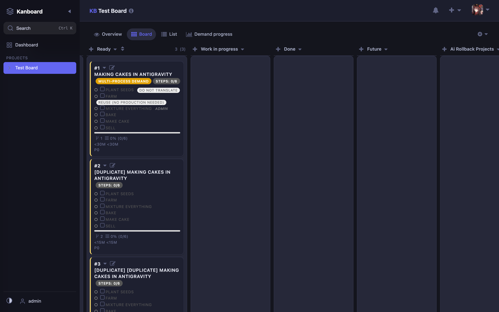
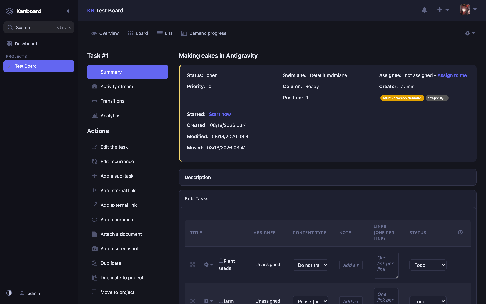
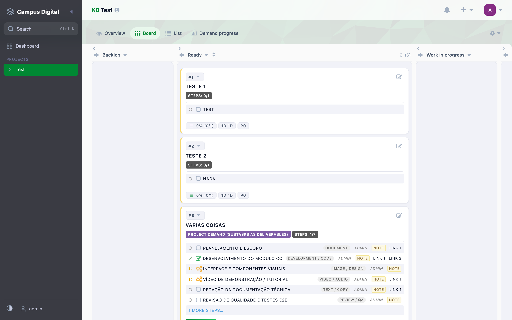

# BoardRenewal

A modern, responsive theme for [Kanboard](https://kanboard.org/) with dark mode, high contrast support, and per-project customization.



## Features

### 🎨 Visual Design
- **Modern UI**: Clean, minimal design inspired by Linear and Vikunja
- **Responsive**: Works seamlessly on desktop, tablet, and mobile
- **Glassmorphism**: Subtle transparency effects on sidebar, topbar, and modals
- **Custom Icons**: Modern rounded SVG icons throughout the interface

### 🌓 Theme Modes
- **Light Mode**: Clean, bright interface for daytime use
- **Dark Mode**: Easy on the eyes for night work
- **Auto Mode**: Automatically follows your system preference
- **High Contrast**: Enhanced visibility for accessibility

### 🎯 Key Improvements
- **Color-coded Cards**: Task cards show category color as a left border instead of full background
- **Improved Readability**: Better contrast ratios across all theme modes
- **Consistent Spacing**: Unified spacing system throughout the interface
- **Custom Checkboxes**: Styled checkboxes that match the theme

### 📱 Responsive Design
- Collapsible sidebar with project initials
- Horizontal scrolling board that extends under the sidebar
- Mobile-optimized layouts for all pages

## Installation

### Method 1: Direct Download
1. Download the latest release from [GitHub Releases](https://github.com/magikarp13/boardrenewal/releases)
2. Extract the archive to your Kanboard `plugins/` directory
3. The plugin folder should be `plugins/BoardRenewal/`

### Method 2: Git Clone
```bash
cd /path/to/kanboard/plugins
git clone https://github.com/magikarp13/boardrenewal.git BoardRenewal
```

### Method 3: Manual Installation
1. Copy the `BoardRenewal` folder to your Kanboard `plugins/` directory
2. Ensure the folder structure is: `plugins/BoardRenewal/Plugin.php`

## Configuration

### Theme Selection
The theme mode is controlled by the `data-theme` attribute on the `<html>` element:
- `light` - Light mode
- `dark` - Dark mode  
- `auto` - Follows system preference (default)

### High Contrast Mode
Enable high contrast mode with `data-contrast="high"` on the `<html>` element.

### Per-Project Customization (Coming Soon)
Future versions will support:
- Custom colors per project
- Project-specific layouts
- Custom uploads per project

## Browser Support

- Chrome/Edge 90+
- Firefox 88+
- Safari 14+
- Opera 76+

## Development

### Requirements
- Node.js 16+
- npm 8+

### Build Process
```bash
# Install dependencies
npm install

# Build CSS from SCSS
npm run build

# Watch for changes (development)
npm run watch
```

### Project Structure
```
BoardRenewal/
├── Plugin.php                 # Main plugin file
├── Helper/
│   └── BoardRenewalHelper.php # Template helper
├── Template/
│   ├── layout.php            # Main layout override
│   ├── sidebar.php           # Custom sidebar
│   └── task_creation/        # Task creation overrides
├── Assets/
│   ├── css/
│   │   └── boardrenewal.css  # Compiled CSS
│   ├── js/
│   │   └── boardrenewal.js   # JavaScript
│   └── src/
│       └── sass/             # SCSS source files
│           ├── main.scss
│           ├── _tokens.scss
│           ├── _base.scss
│           ├── _shell.scss
│           ├── _board.scss
│           ├── _components.scss
│           ├── _icons.scss
│           └── _responsive.scss
└── docs/
    └── screenshots/          # Documentation images
```

### SCSS Architecture
The theme uses a modular SCSS architecture:
- **`_tokens.scss`**: CSS custom properties (colors, spacing, shadows)
- **`_base.scss`**: Global styles, body, layout structure
- **`_shell.scss`**: Sidebar, topbar, header
- **`_board.scss`**: Board view, columns, cards
- **`_components.scss`**: Forms, tables, modals, dropdowns
- **`_icons.scss`**: SVG icon styles and mixins
- **`_responsive.scss`**: Mobile breakpoints and adjustments

## Color Tokens

The theme uses CSS custom properties for consistent theming:

```css
/* Primary Colors */
--br-accent: #6366f1;          /* Indigo */
--br-accent-hover: #4f46e5;
--br-accent-soft: #eef2ff;

/* Background Colors */
--br-bg: #fafafa;              /* Light mode */
--br-surface: #ffffff;
--br-surface-2: #f1f2f8;

/* Text Colors */
--br-text: #0f172a;
--br-text-secondary: #475569;
--br-text-muted: #94a3b8;

/* Borders */
--br-border: #e5e7ef;
--br-border-strong: #cbd5e1;

/* Shadows */
--br-shadow-sm: 0 1px 2px rgba(15, 23, 42, 0.06);
--br-shadow-md: 0 4px 12px rgba(15, 23, 42, 0.10);
```

Dark mode values are automatically applied via `[data-theme="dark"]`.

## Category Colors

Task categories are displayed as left borders on cards:

| Category Class | Color |
|---------------|-------|
| `color-yellow` | #f5d76e |
| `color-blue` | #5dade2 |
| `color-green` | #58d68d |
| `color-red` | #ec7063 |
| `color-orange` | #f0b27a |
| `color-purple` | #af7ac5 |
| `color-grey` | #95a5a6 |
| `color-brown` | #a0522d |
| `color-dark_grey` | #34495e |
| `color-dark_orange` | #d35400 |
| `color-dark_blue` | #2c3e50 |
| `color-dark_green` | #27ae60 |
| `color-dark_red` | #c0392b |
| `color-medium_orange` | #e67e22 |
| `color-medium_blue` | #2980b9 |
| `color-medium_green` | #16a085 |
| `color-medium_red` | #c0392b |
| `color-medium_purple` | #8e44ad |

## Compatibility

- **Kanboard Version**: 1.2.53+
- **PHP Version**: 7.4+
- **Database**: Any (SQLite, MySQL, PostgreSQL)

## Known Issues

- Some third-party plugins may have styling conflicts
- Custom CSS from other themes may override BoardRenewal styles

## Roadmap

### Version 0.2.0
- [ ] Per-project theme customization
- [ ] Project-specific color schemes
- [ ] Custom logo upload per project
- [ ] Advanced sidebar configuration

### Version 0.3.0
- [ ] Command palette (Ctrl+K)
- [ ] User preferences panel
- [ ] Additional icon sets
- [ ] Animation preferences

## Contributing

Contributions are welcome! Please feel free to submit a Pull Request.

1. Fork the repository
2. Create your feature branch (`git checkout -b feature/amazing-feature`)
3. Commit your changes (`git commit -m 'Add amazing feature'`)
4. Push to the branch (`git push origin feature/amazing-feature`)
5. Open a Pull Request

## License

This project is licensed under the MIT License - see the [LICENSE](LICENSE) file for details.

## Credits

- **Kanboard**: [Frédéric Guillot](https://github.com/kanboard/kanboard)
- **Icons**: Custom SVG icons inspired by [Lucide](https://lucide.dev/) and [Vikunja](https://vikunja.io/)
- **Color Palette**: [Tailwind CSS](https://tailwindcss.com/) inspired

## Support

If you encounter any issues or have questions:
- Open an issue on [GitHub](https://github.com/magikarp13/boardrenewal/issues)
- Check existing issues before creating a new one

## Screenshots

### Board View (Dark Mode)


### Task View (Dark Mode)


### Board View (Light Mode)


---

Made with ❤️ for the Kanboard community
